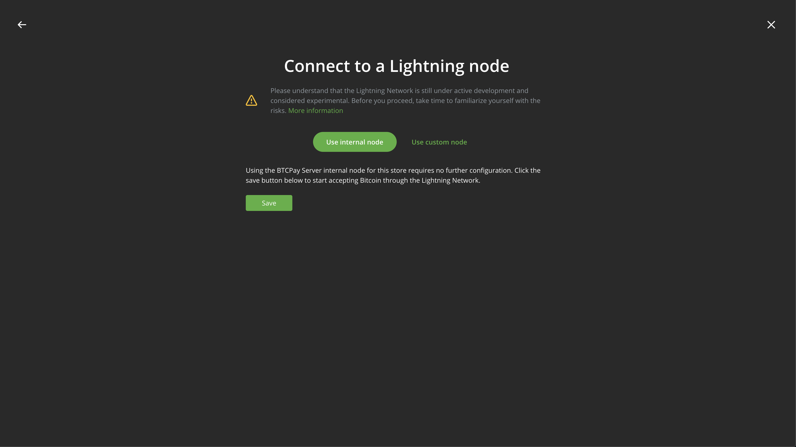

# Using BTCPay Server

## Key Information

The instance of BTCPay Server running on your Embassy is your *own*, self-hosted payment processor for Bitcoin and other cryptocurrencies. The interface is served from your Embassy alone - you are not trusting a third party hosted instance to store your data and serve content. All information lives on your Embassy.

This service provides an enormous amount of functionality surrounding creating stores, generating invoices, and accepting payments. Please visit the visit the official [docs](https://docs.btcpayserver.org/) for details on the full capabilities.

BTCPayServer Vault is not yet supported for hardware wallet integration.

## Creating your Account

When you visit your BTCPay Server for the first time, you will be asked to create an account - this will be the admin user account. Note, *you are creating an account with yourself* - there are no third parties involved storing your password on a remote server. The password is stored on the Embassy in the BTCPay Server database and is not editable from the service config page. Please save this password in a password manager, such as Bitwarden.

By default, additional registrations are disabled. This means once you create an account, no one else will be permitted to create an account on your instance. The admin user can add additional accounts under `Server settings > Users`.

Registrations can be enabled under `Server settings > Policies`, or by using the "Reset Server Policies" action.

## Configuring Email

Email configuration is recommended for:

1. Enabling the optimal password reset flow for all users
1. Receiving invoice/payment notifications
1. Capturing store related events, such as sending invoices.

Since you are running your own instance, if you want to receive email notifications, you will have to send them yourself. This can be done from your own SMTP server, or by using an account with a hosted SMTP server, such as Gmail, Yahoo, Mailgun, Office365, SendGrid, etc. For specific instructions on how to configure these settings, please visit the official [documentation](https://docs.btcpayserver.org/FAQ/FAQ-ServerSettings/#how-to-configure-smtp-settings-in-btcpay).

## Forgot Password

If you forget your BTCPay Server admin password and you have email configured, please follow the "Forgot password" flow when attempting to login.

If you forgot your BTCPay Server admin password and you *do not* have email configured, please use the "Reset Admin Password" action to create a temporary password. Don't forget to change your password once logged in.

If you forgot your BTCPay Server password and you are not an admin user, please attempt to use the "Forgot password" flow when attempting to login. If you do not receive an email, reach out to your account admin so they can check or setup the email configuration.

## Enabling Lightning

**Important**

BTCPay Server is compatible with multiple lightning implementations, including the ones running on your Embassy. These are called "Internal Nodes" in BTCPay. To begin using Lightning, your Bitcoin blockchain needs to be fully synced.

**Do not** attempt to follow the directions in the BTCPay interface *unless you know what you are doing*. Please follow the instructions below to enable lightning.

If you would like to **use your Embassy's lightning node** for BTCPay:

1. Open your BTCPay Server service details page and select `Config`. 
1. Navigate to `Lightning` and select the internal lightning implementation you would like to use for BTCPay. 
1. Save this setting. BTCPay will now be able to recognize the internal lightning node running on EmbassyOS.

To **enable lightning** for a particular store's wallet using your Embassy's lightning node:

1. Navigate to `Stores > Settings > General Settings > Lightning > Modify`. 
1. On the page entitled "Connect to a Lightning node", select "Use internal node"
1. Click "Save".

<!-- MD_PACKER_INLINE BEGIN -->

<!-- MD_PACKER_INLINE END -->

If you would like to connect to an external lightning node, follow the instructions in the BTCPay web interface. 

## Updates

Manual maintenance updates are disabled. Updates for BTCPay Server will be delivered through the Start9 Marketplace.

## Advanced

The BTCPay Server documentation can recommend `ssh` or `docker-compose` commands for resolving issues. The way BTCPay Server is configured for your Embassy is different than the default installation, which is meant to run on a standalone server instance. Start9 has consolidated BTCPay Server to run in an optimal way, so please reach out to the team for support in these circumstances. Adding an SSH key to your device to manually debug voids the warranty and Start9 cannot assure that operations will continue to function as intended. 

## Tips

To enable dark mode, navigate to `Server Settings > Theme > Select Theme`, select `Default (Dark)` and save. 